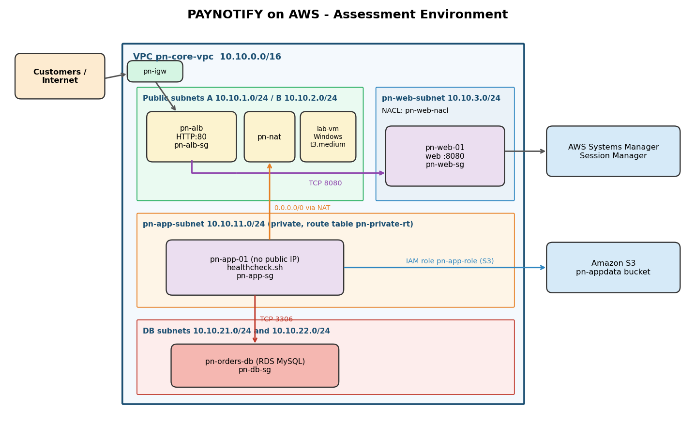
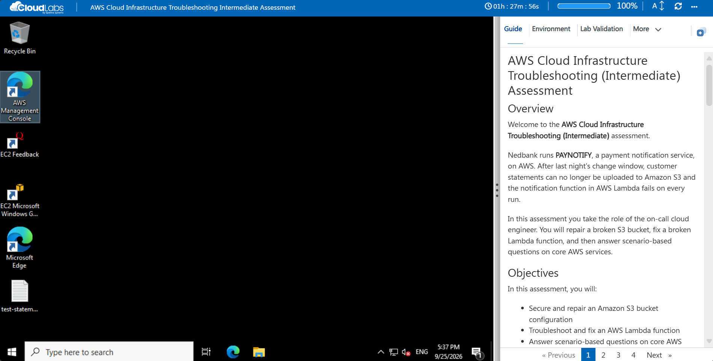
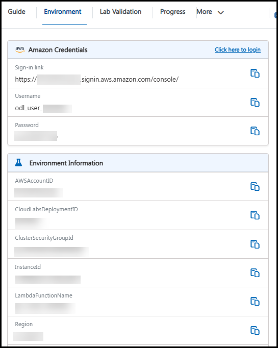
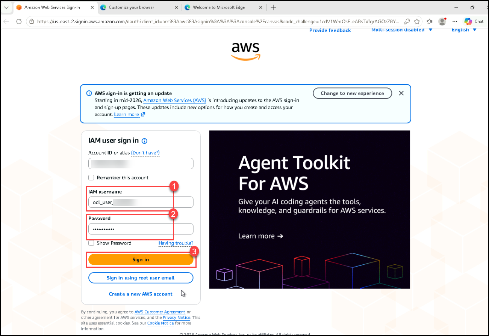
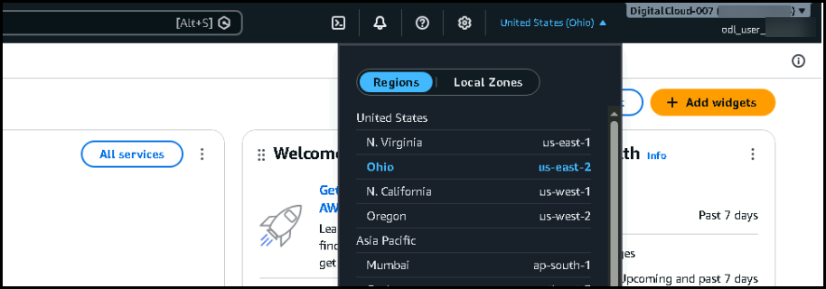
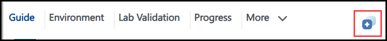
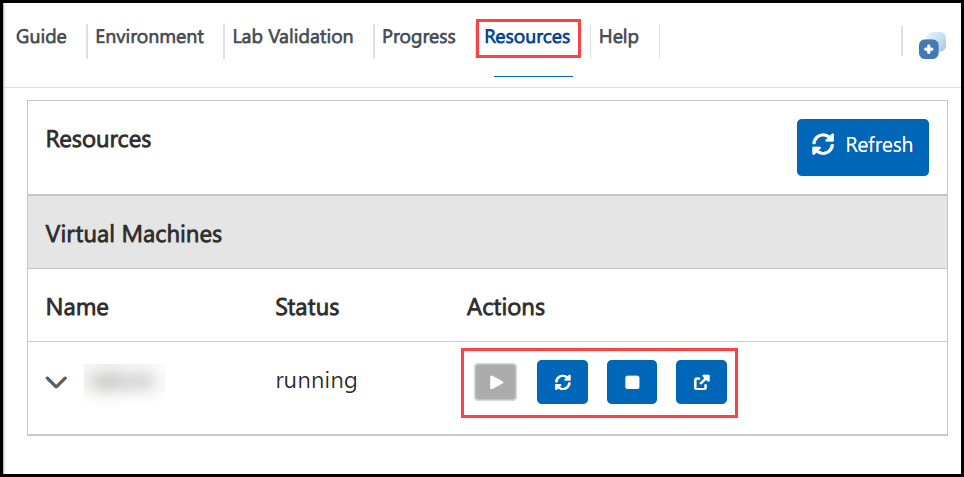
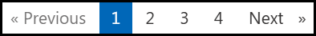

# AWS Cloud Infrastructure Troubleshooting (Intermediate) Assessment

## Overview

Welcome to the **AWS Cloud Infrastructure Troubleshooting (Intermediate)** assessment.

Nedbank runs **PAYNOTIFY**, a payment notification service, on AWS. After last night's change window, customer statements can no longer be uploaded to Amazon S3 and the notification function in AWS Lambda fails on every run.

In this assessment you take the role of the on-call cloud engineer. You will repair a broken S3 bucket, fix a broken Lambda function, and then answer scenario-based questions on core AWS services.

## Objectives

In this assessment, you will:

- Secure and repair an Amazon S3 bucket configuration
- Troubleshoot and fix an AWS Lambda function
- Answer scenario-based questions on core AWS services

## Prerequisites

Participants should have basic knowledge of the following:

- Amazon S3 buckets, bucket policies and versioning
- AWS Lambda functions, handlers and environment variables
- IAM roles and policies

## Architecture

- **pn-statements** is the S3 bucket that stores customer statements and notification records.
- **pn-notify** is a Python Lambda function that writes a notification record to the **pn-statements** bucket.
- You work from a Windows virtual machine and the AWS Management Console.

## Scenario Breakdown

| Scenario | Title | Type | Tasks |
|---|---|---|---|
| Scenario 1 | Repair the PAYNOTIFY Statements Bucket | Hands-on | 1 validated task |
| Scenario 2 | Repair the PAYNOTIFY Notification Function | Hands-on | 1 validated task |
| Scenario 3 | Review the PAYNOTIFY Network Basics | Questions | 6 questions |

## Scoring Summary

- Scenario 1 and Scenario 2 are scored by the **Validate** button at the end of the scenario task.
- Scenario 3 contains single choice questions. Each correct answer carries **2 marks**.
- Each question allows **1** retry.

## Environment Details

| Item | Value |
|---|---|
| AWS Region | <inject key="Region" enableCopy="true"/> |
| Deployment ID | <inject key="CloudLabsDeploymentID" enableCopy="true"/> |
| Statements bucket | <inject key="StatementsBucket" enableCopy="true"/> |
| Lambda function | <inject key="LambdaFunctionName" enableCopy="true"/> |

All resources in this assessment carry the suffix **-<inject key="CloudLabsDeploymentID" />** in their names, for example **pn-notify-<inject key="CloudLabsDeploymentID" />**.

## Accessing Your Assessment Environment

Once you are ready to begin, your virtual machine and **Guide** are available within your web browser.

## Virtual Machine and Assessment Guide

Your Windows virtual machine is your workstation throughout this assessment. If you are asked to sign in to the virtual machine, use the following credentials:

- **Username:** <inject key="VMUserName" enableCopy="true"/>
- **Password:** <inject key="VMPassword" enableCopy="true"/>

## Exploring Your Assessment Resources

To view your AWS console credentials and resource details, navigate to the **Environment** tab.

## Signing in to the AWS Management Console

1. On the virtual machine, open **Microsoft Edge**.

1. Navigate to the AWS console sign-in URL shown on the **Environment** tab.

1. Sign in with the **AWS username (1)** and **AWS password (2)** shown on the **Environment** tab, then select **Sign in (3)**.

   

1. In the top-right corner of the console, confirm that the Region is set to **<inject key="Region" />**.

   

   > **Note:** All assessment resources are deployed in this Region. If you do not see a resource, check the Region selector first.

## Utilizing the Split Window Feature

For convenience, you can open the assessment guide in a separate window by selecting the **Split Window** button from the top-right corner.

## Managing Your Virtual Machine

You can start, stop or restart your virtual machine as needed from the **Resources** tab.

## Support Contact

The **CloudLabs support team** is available 24/7, 365 days a year, via email and live chat. We offer dedicated support channels for both learners and instructors.

Learner Support Contacts:

- Email Support: cloudlabs-support@spektrasystems.com

- Live Chat Support: https://cloudlabs.ai/labs-support

Now, click **Next** from the lower-right corner to begin Scenario 1.

### Happy Assessing !!
